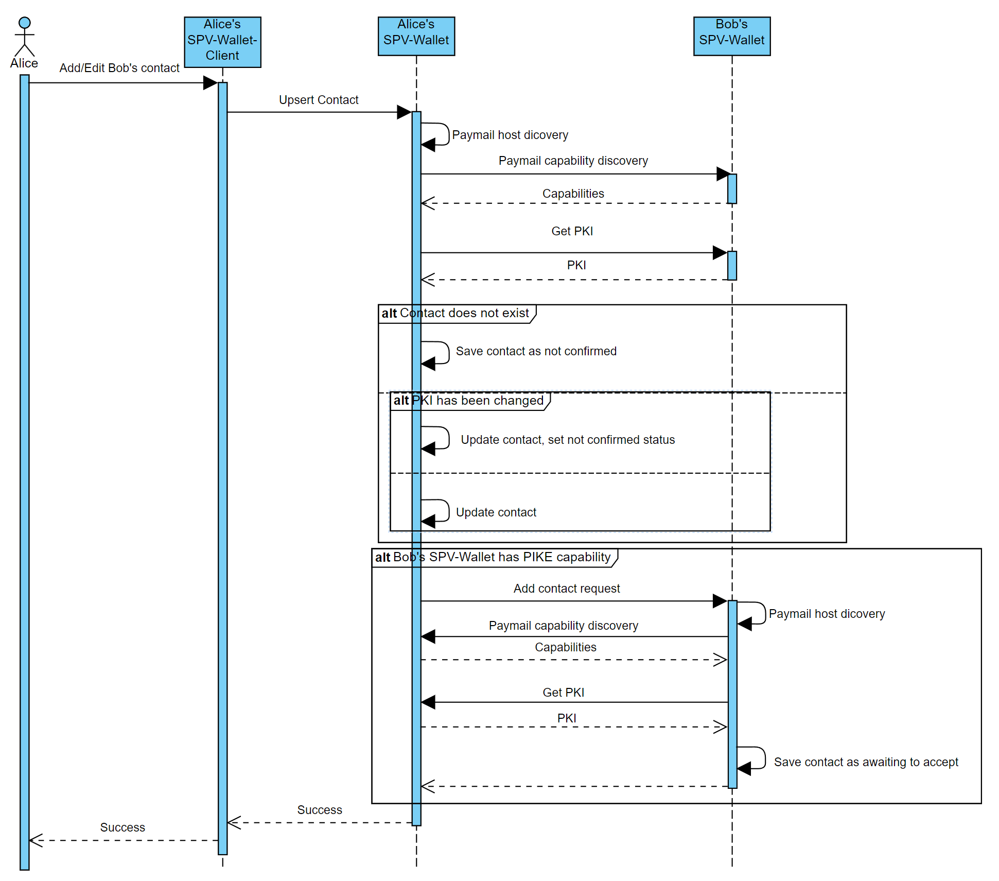
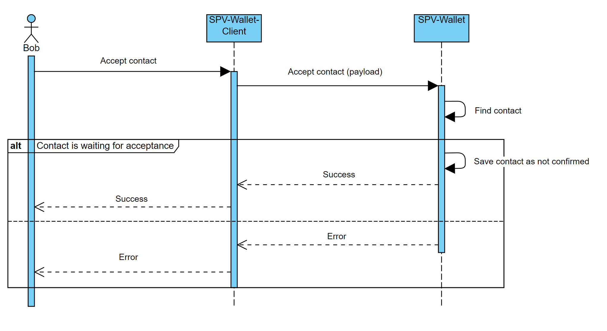
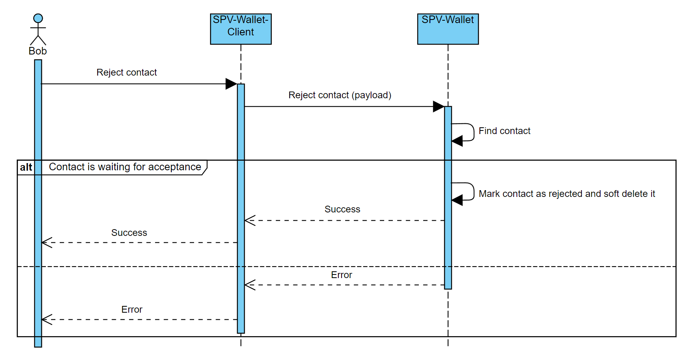
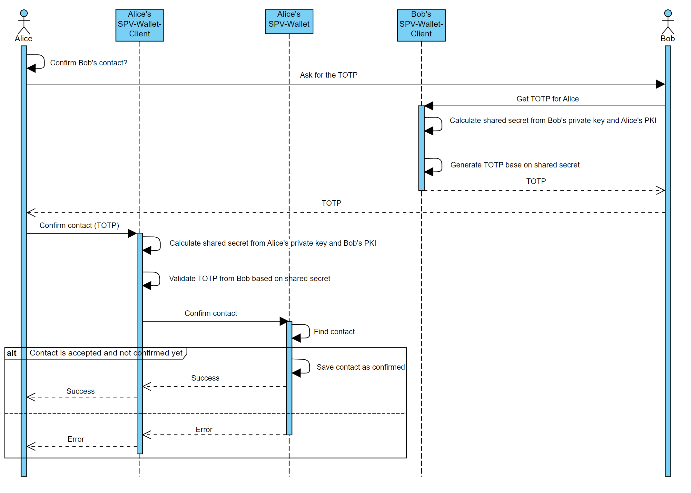

# 🤝 Contacts

The Contacts functionality functions similarly to the phonebook feature on your phone. It is designed for adding and storing familiar and trusted paymail addresses. This enables users to associate identities with paymail addresses and verify that a specific paymail belongs to the correct individual.

## Features

The SPV Wallet allows to manage known paymail as contact in specyfic flow: 

1. Alice can add Bob's paymail as *unconfirmed* contact. SPV Wallet will send request to Bob's wallet to add Alice as contact
2. Bob can accept Alice request or...
3. Bob can reject Alice request
4. Alice and Bob can confirm each others identity using TOTP - contacas are *confirmed* now 

### Adding/editing contact

When Alice is adding a new contact, such as Bob, the wallet verifies Bob's capabilities; if Bob's wallet supports PKI, the contact is saved as *unconfirmed* in Alice's SPV Wallet, and if Bob's wallet supports PIKE, a request to add Alice as a contact is sent. 

If Alice already has Bob's contact its data will be updated (eg. name, email). Furthermore, if Bob's PKI has been changed post-addition to Alice's contacts, his status shifts to *unconfirmed*.

When SPV Wallet receive PIKE request to add new contact, such as Alice, the wallet verifies Alice's capabilities and if her wallert supports PKI, the contact is saved with *awaiting for acceptance* status. 

### Accepting contact request

The user has the option to accept contact requests for further processing. Only contacts in the *awaiting for acceptance* status can be accepted. Upon acceptance, the contact's status shifts to *unconfirmed*.

### Rejecting contact request

The user has the ability to reject contact requests. Only contacts in the *awaiting for acceptance* status can be rejected. Upon rejection, the contact's status shifts to *rejected*, and the contact cannot be processed further.

>NOTICE: SPV Wallet soft deletes rejected contacts.

### Confirming contact

User, such as Alice, has the ability to mark a contact as *confirmed* if she is certain of its validity. To confirm a contact, such as Bob, Alice must ask Bob for a TOTP (Time-based One-Time Password) calculated based on Bob's private key and Alice's public key from her PKI capability. Next, Alice validates the TOTP with her own private key and the public key from Bob's contact. If the validation is successful, Bob's contact is marked as *confirmed*.

Only contacts in *unconfirmed* status can be confirmed.

>NOTICE: Confirmation of Bob's contact by Alice does not result in confirmation of Alice's contact by Bob in his wallet.

