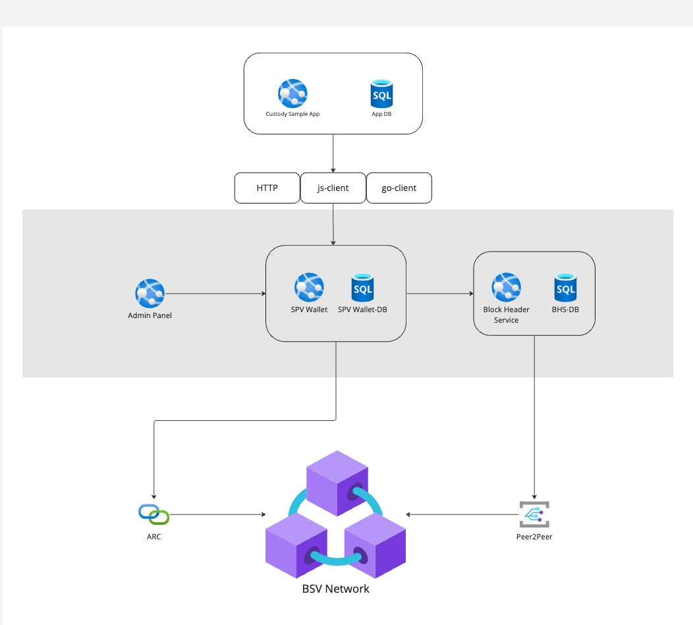
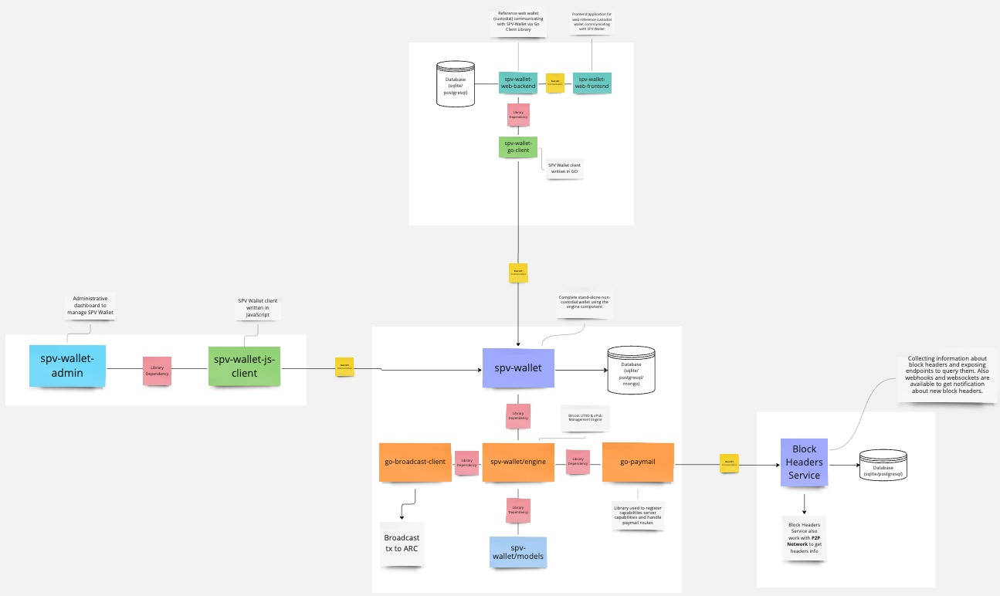

# SPV Wallet Toolbox

## SPV Wallet ecosystem

Those diagrams show how SPV Wallet Toolbox is built. It is a set of tools which can be used to create a wallet,
send and receive transactions, create and manage paymails and more.
It is built to be used as a standalone app or as a module in bigger system.
