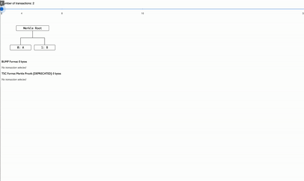

# 🤖 Data Models

There are two main data models used in SPV transactions. Firstly, the Merkle paths of transactions are contained


The Compound Merkle Path Format


<figure><figcaption>
BUMP format demo
</figcaption></figure>

Secondly a list of BUMPs and transactions are serialized:


The encoding format for SPV Transactions


These formats are baked in to the ecosystem's core libraries such that they are easy to deal with across many applications.


TypeScript SDK



Golang SDK



[broadcasting.md](broadcasting.md)

