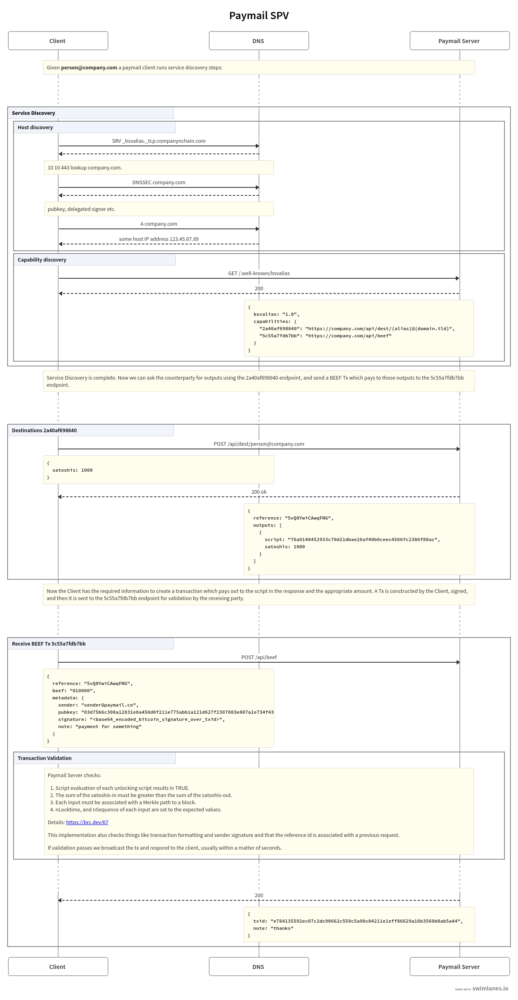

# 💵 Payments Flow

The SPV Wallet uses Paymail capabilities to publicly reveal their ability to interpret SPV transaction data.


### What is Paymail?

It's a service discovery mechanism for counterparty web APIs. It allows users to pay something which looks like an email address, but under the hood resolves a specific endpoint for a wallet to use for payment negotiation.\
\
<mark style="color:yellow;">**user@domain.tld**</mark> -> _<mark style="color:blue;">https://domain.tld/api/some/specific/endpoint</mark>_


### Sequence Diagram

<figure><figcaption></figcaption></figure>

### Capability Specifications

Further details on exactly how these requests and responses should be formulate are defined in these BRC documents:


Getting Outputs to Pay To



The Paymail Capability for Delivering SPV Transactions

