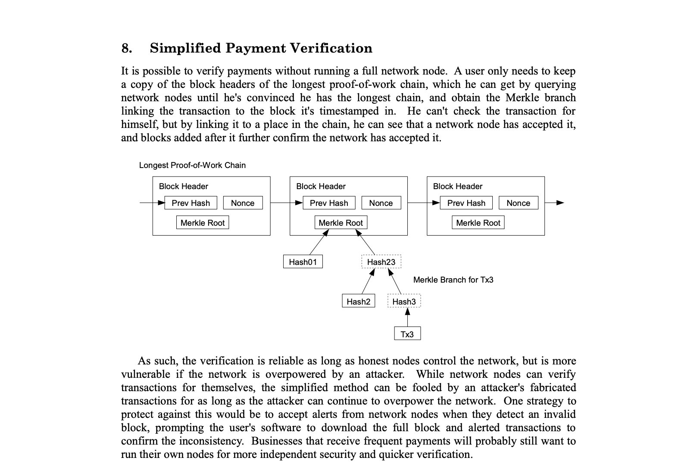

# ✅ SPV Definition

The Bitcoin white paper detailed how non-miners could verify transactions given to them.

<figure><picture><source srcset="../.gitbook/assets/image (14).png" media="(prefers-color-scheme: dark)"></picture><figcaption>
<a href="https://craigwright.net/bitcoin-white-paper.pdf">https://craigwright.net/bitcoin-white-paper.pdf</a>
</figcaption></figure>

Dr. Craig S. Wright further detailed his thinking on the topic in several blog posts over the years:


Further Insights from Dr. Craig S. Wright


The specifics of the implementation used in the SPV Wallet BUX are contained in this BRC:


Simplified Explanation

